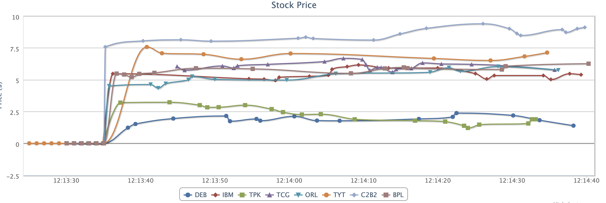
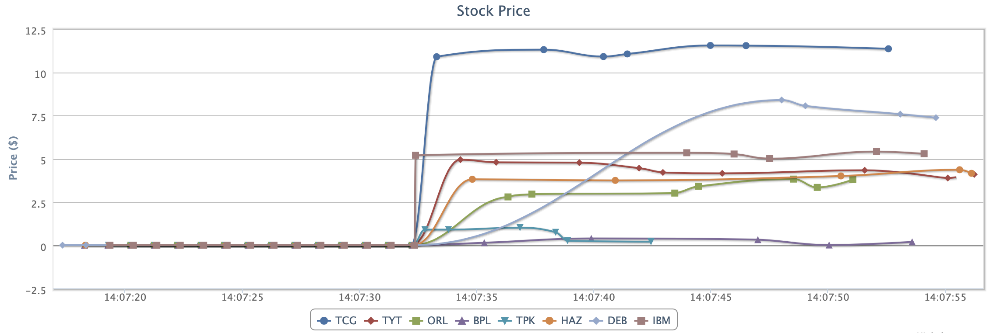
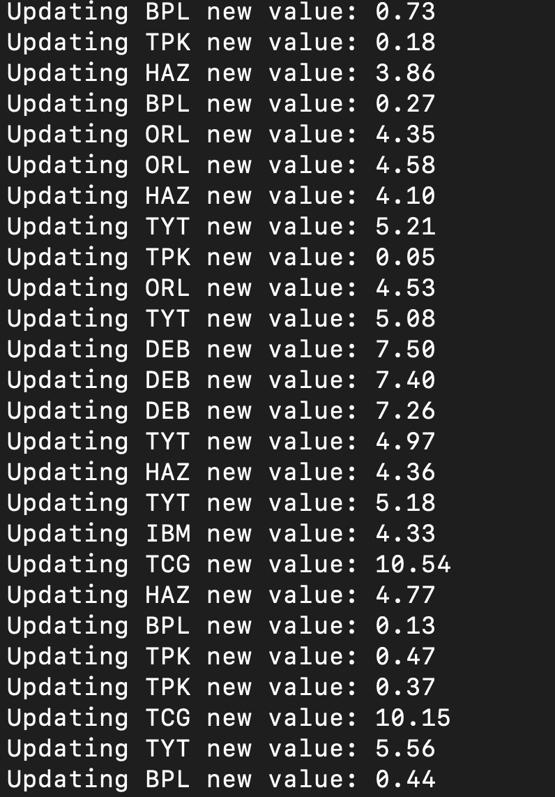

To run this demo you'll need a copy of Tomcat or another Web Container with support for JSR-356.

Build the project with `mvn clean install -DskipTests` 

Start the test: 
mvn tests 

Install Tomcat webserver: 
OSX>brew install tomcat 

Add a user to the manager-gui if you wish to deploy the war file dynamically: 
OSX>vi /Users/yournamehere/homebrew/Cellar/tomcat/9.0.16/libexec/conf/tomcat-users.xml 

Start tomcat in the foreground (testing purposes) 
OSX>catalina run 

Deploy /hazelcast-web 
http://localhost:8080/manager/html 

Load up the stockticker.jsp 
open http://localhost:8080/hazelcast-web/stockticker.jsp 

Load up the Swing consumer: 
hazelcast-client/controller.Controller.main 

Swing Interface - WebSocket Consuming Stock updates 

 
Web Interface - WebSocket Consuming Stock updates 

 
Stock Ticker Updater 

 
